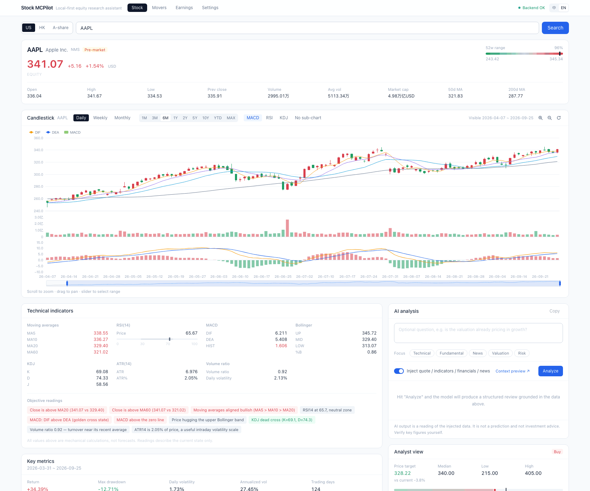
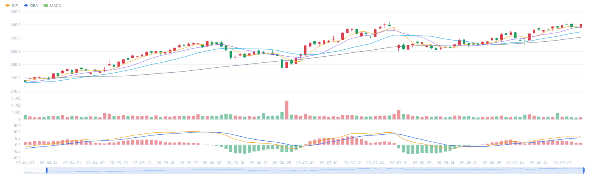
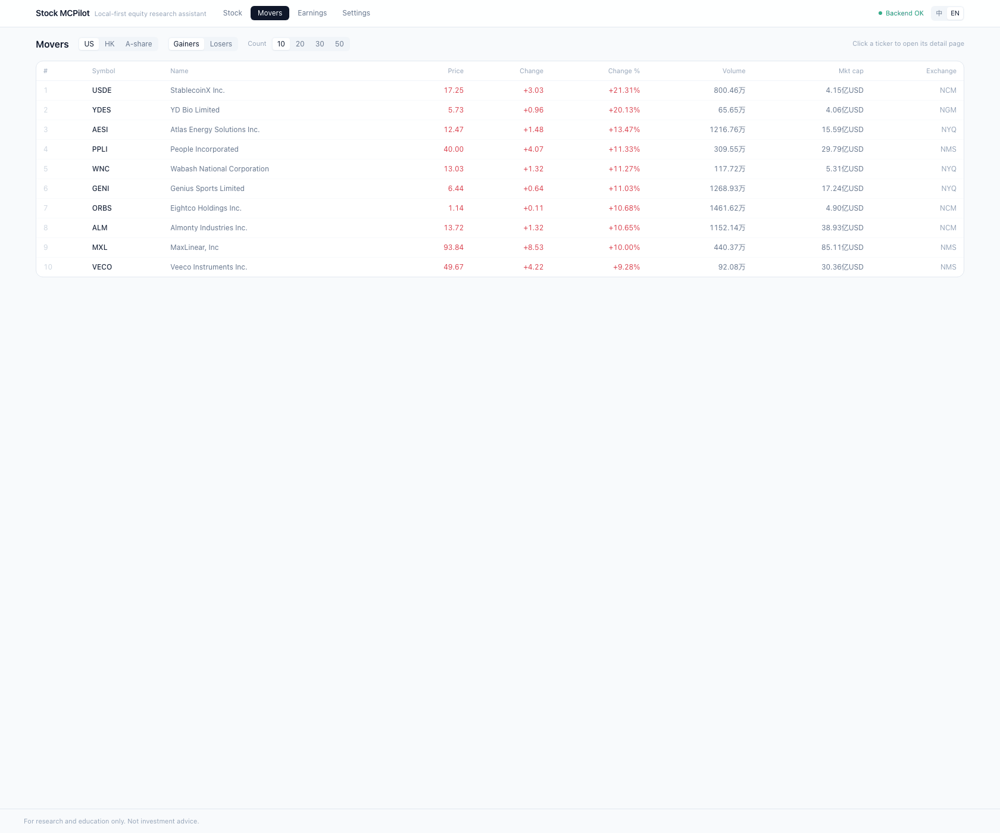
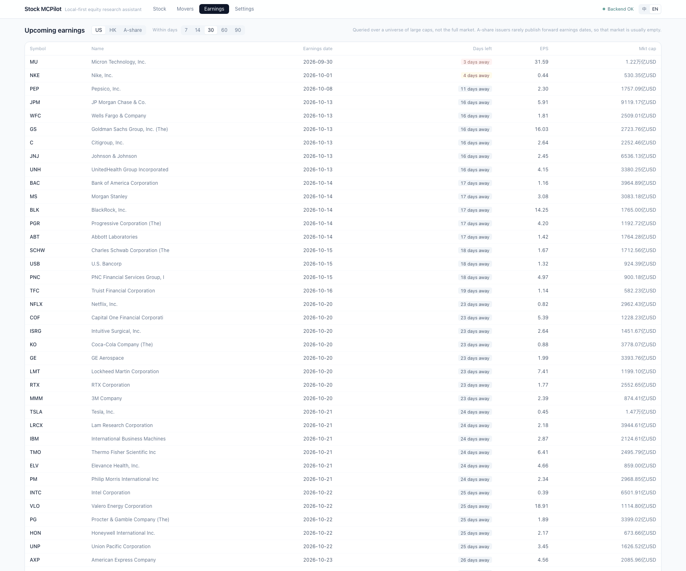
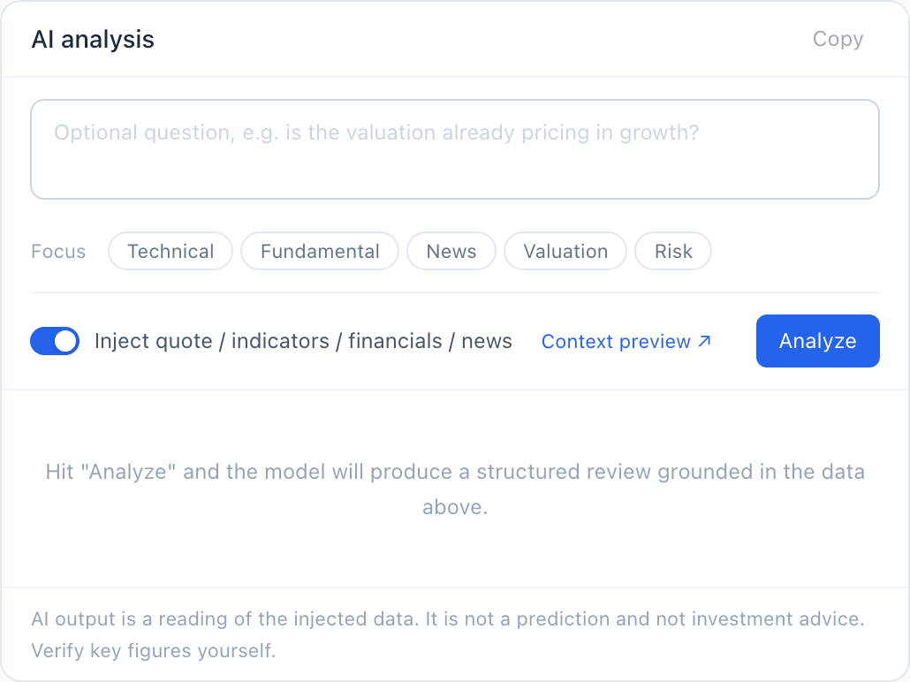
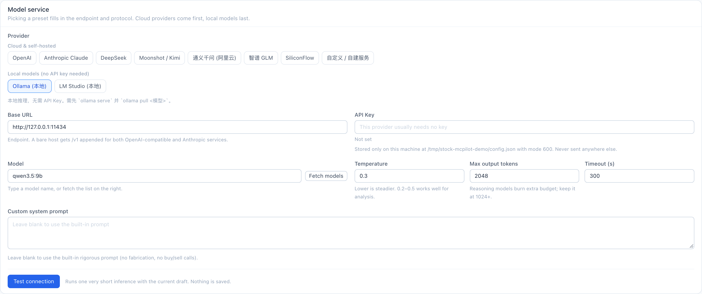

# Stock MCPilot

**English** · [简体中文](README.zh.md)

> A local-first stock research cockpit. Quotes, interactive charts, financials, news and
> AI analysis — powered by the model **you** choose, running on **your** machine.

[](LICENSE)
[](https://www.python.org/)
[](https://nodejs.org/)
[](https://tauri.app/)

Most "AI stock" tools ask you to hand your brokerage data and API keys to somebody's
server. Stock MCPilot does the opposite: everything runs locally, your keys never leave
the machine, and the LLM is whatever you point it at — a cloud API (OpenAI, Anthropic,
DeepSeek…) or a model running on your own GPU (Ollama, LM Studio).

---

## Table of contents

- [What it looks like](#what-it-looks-like)
- [Features](#features)
- [Choosing a model](#choosing-a-model)
  - [Cloud providers](#cloud-providers)
  - [Local models](#local-models)
  - [Where your API key lives](#where-your-api-key-lives)
- [Quick start](#quick-start)
- [Running the desktop app](#running-the-desktop-app)
- [Configuration reference](#configuration-reference)
- [Project layout](#project-layout)
- [Tests](#tests)
- [Troubleshooting](#troubleshooting)
- [Contributing](#contributing)

---

## What it looks like



*Everything about one ticker on one screen: quote, interactive chart, technical readings,
and an AI analysis panel that tells you exactly what it is about to send to the model.*

---

## Features

### 📈 One ticker, one screen

Type a symbol or a company name — `AAPL`, `0700`, `600519` — and get the whole picture:
price and change, 52-week range position, open/high/low/previous close, volume, turnover,
market cap, MA50/MA200, and the current session state (pre-market / open / lunch break /
closed) resolved per market timezone.

Search works across **US, Hong Kong and A-share** markets, in English or Chinese.

### 📊 Charts you can actually drive



- Candlestick with **MA5/10/20/60** and **Bollinger Bands** overlays
- Sub-panels for **volume, MACD, RSI and KDJ** — toggle them independently
- Period and interval switching: `1M 3M 6M 1Y 2Y 5Y 10Y YTD MAX` ×
  `1m 5m 15m 30m 60m 1d 1wk 1mo`
- **Zoom in / zoom out / reset**, mouse-wheel zoom, drag to pan, and a range slider —
  with a live readout of the visible window (`Visible 2026-04-07 ~ 2026-09-25`)

Red for up, green for down — the convention Chinese markets actually use.

### 🔥 Movers



Top gainers and losers per market, sortable, with price, change, volume and market cap.

### 📅 Earnings calendar



Upcoming earnings over a configurable horizon, with days-until countdown, EPS estimates
and market cap. (Queried over a universe of large caps, not the full market — A-share
issuers rarely publish forward earnings dates, so that market is usually empty. The app
says so instead of pretending otherwise.)

### 🔬 Fundamentals, estimates and analyst view

| Panel | What's in it |
|---|---|
| **Technical indicators** | MA / RSI / MACD / Bollinger / KDJ / ATR / volume ratio, each with a plain-language reading ("price is above MA20", "MACD golden cross", "RSI 65.7, neutral-to-strong") |
| **Key metrics** | Range return, max drawdown, daily and annualised volatility, max single-day gain/loss, up/down day counts |
| **Company profile** | Sector, industry, employees, website, valuation (P/E, PEG, P/B, P/S, EV/EBITDA), profitability (margins, ROE, ROA), balance sheet (debt/equity, current ratio), dividends, analyst targets, short interest |
| **Financials** | Annual and quarterly statements |
| **Earnings & estimates** | Next earnings date, EPS history with surprise %, EPS and revenue estimates, trends and revisions |
| **Analyst view** | Target high / mean / median / low, recommendation distribution over time, institutional and insider holdings |
| **Recent news** | Headlines with publisher, timestamp and a link to the original article |

### 🤖 AI analysis that knows what it is talking about



Pick a focus — **technical / fundamental / news / valuation / risk** — optionally add your
own question, and hit *Analyze*. Before anything is sent, you can open
**"What gets sent to the model"** and read the exact assembled prompt.

The context is built from the same data you are looking at: quote, technical snapshot,
candle summary, company profile, financials, earnings estimates, analyst view and recent
news. Each section is individually toggleable, and there is a character budget so you
cannot accidentally blow past your model's window.

The response streams in, renders as Markdown, and can be copied with one click.

> AI output is a **cultural reading of the data, not a forecast**. The built-in system
> prompt forbids fabricating numbers and refuses to give buy/sell instructions. Nothing
> here is investment advice.

---

## Choosing a model



Open **Settings → Model service**. Providers are grouped, **cloud services first, local
models last**:

```
Cloud & self-hosted   OpenAI · Anthropic Claude · DeepSeek · Moonshot / Kimi ·
                      Qwen (Aliyun) · Zhipu GLM · SiliconFlow · Custom / self-hosted
Local models          Ollama · LM Studio
```

Pick a preset and the endpoint and protocol are filled in for you. Then hit
**Test connection** — it does a real round-trip (list models *and* a tiny generation), so
a green result means inference actually works, not just that the port is open.

### Cloud providers

| Provider | Endpoint (auto-filled) | Key from | Example model |
|---|---|---|---|
| **Anthropic Claude** | `https://api.anthropic.com` | [console.anthropic.com](https://console.anthropic.com/settings/keys) | `claude-sonnet-5` |
| **OpenAI** | `https://api.openai.com/v1` | [platform.openai.com](https://platform.openai.com/api-keys) | `gpt-4o-mini` |
| **DeepSeek** | `https://api.deepseek.com/v1` | [platform.deepseek.com](https://platform.deepseek.com/) | `deepseek-chat` |
| **Moonshot / Kimi** | `https://api.moonshot.cn/v1` | [platform.moonshot.cn](https://platform.moonshot.cn/) | `moonshot-v1-8k` |
| **Qwen (Aliyun)** | `https://dashscope.aliyuncs.com/compatible-mode/v1` | [bailian.console.aliyun.com](https://bailian.console.aliyun.com/) | `qwen-plus` |
| **Zhipu GLM** | `https://open.bigmodel.cn/api/paas/v4` | [open.bigmodel.cn](https://open.bigmodel.cn/) | `glm-4-flash` |
| **SiliconFlow** | `https://api.siliconflow.cn/v1` | [siliconflow.cn](https://siliconflow.cn/) | `Qwen/Qwen2.5-7B-Instruct` |
| **Custom** | anything | — | — |

**Anthropic** uses the native Messages API (`POST /v1/messages`, `anthropic-version:
2023-06-01`), not an OpenAI-compatible shim — so system prompts, `max_tokens` and
streaming all behave the way the vendor documents. Current models:
`claude-opus-5-5` (strongest), `claude-sonnet-5` (best speed/intelligence balance, the
default), `claude-haiku-4-5-20251001` (cheapest).

**Custom / self-hosted** covers anything speaking `/v1/chat/completions` — vLLM, LocalAI,
one-api, an internal company gateway. Point it at an Anthropic-compatible gateway and the
protocol is auto-detected from the URL.

**Worked example — Anthropic in 30 seconds**

1. Create a key at `console.anthropic.com` → *API keys*
2. Settings → Model service → **Anthropic Claude**
3. Paste the key into **API Key** (it renders as `sk-a****wxyz` and is stored locally)
4. Leave the model as `claude-sonnet-5`, or type another one
5. **Test connection** → expect *"Connection and inference OK (… ms)"*
6. **Save**

### Local models

No API key, no per-token cost, nothing leaves your machine.

**Ollama**

```bash
# 1. Install from https://ollama.com/download, then:
ollama pull qwen3.5:9b      # or llama3.1:8b, qwen3:14b, deepseek-r1:8b …
ollama serve                # usually already running as a background service
```

Then in **Settings → Model service → Ollama (local)** click **Fetch models** and pick one
from the dropdown. Default endpoint is `http://127.0.0.1:11434`.

> Reasoning models (`qwen3`, `deepseek-r1`, …) spend output tokens on their chain of
> thought before writing anything, and those tokens count against **Max output tokens**.
> Budget generously — a model can burn a few hundred tokens just to say "OK".
> The *Test connection* probe uses its own fixed budget (1024–4096) rather than your
> setting, so on a very chatty reasoning model the probe can fail while real analysis
> works fine. See [Troubleshooting](#troubleshooting).

**LM Studio**

1. Install from [lmstudio.ai](https://lmstudio.ai/), download a model in the *Discover* tab
2. Go to the *Developer* tab → **Start Server** (default port `1234`)
3. In the app: **Settings → Model service → LM Studio (local)**, click **Fetch models**,
   pick the model you loaded

The model name must match what LM Studio has actually loaded — if the list comes back
empty, no model is loaded yet.

**Anything else**: use **Custom / self-hosted** and enter the full base URL.

### Where your API key lives

- Written to `~/.stock-mcpilot/config.json`, directory `0700`, file `0600`
- **Never** returned over HTTP. The API exposes only a mask (`sk-a****wxyz`) and an
  `api_key_set` boolean. Even error messages are checked for key leakage.
- **Never** logged, and never included in the context sent to a model
- The backend binds `127.0.0.1` only. `python run.py --host 0.0.0.0` is refused unless you
  pass `--allow-remote`, because anyone on your LAN could otherwise burn your API quota
  through `/llm/chat`
- The desktop app talks to the backend over loopback only, with a strict CSP

---

## Quick start

### 0. Prerequisites

| | Version | Needed for |
|---|---|---|
| **Python** | 3.10 or newer (3.11/3.12 recommended) | the backend — required |
| **Node.js** | 18 or newer (20 LTS recommended) | the web UI — required |
| **Rust** | 1.77+ stable | the desktop app — optional |
| **WebView2** | — | Windows desktop only (preinstalled on Win 11 / most Win 10) |
| **WebKitGTK** | — | Linux desktop only (see below) |

### 1. Get the code

```bash
git clone https://github.com/<your-account>/stock-mcpilot.git
cd stock-mcpilot
```

### 2. Set up the backend

<details open>
<summary><b>macOS / Linux</b></summary>

```bash
python3 -m venv .venv
source .venv/bin/activate
pip install --upgrade pip
pip install -r backend/requirements.txt
```
</details>

<details>
<summary><b>Windows (PowerShell)</b></summary>

```powershell
python -m venv .venv
.venv\Scripts\Activate.ps1
python -m pip install --upgrade pip
pip install -r backend\requirements.txt
```

If PowerShell refuses to run the activation script:

```powershell
Set-ExecutionPolicy -Scope Process -ExecutionPolicy Bypass
```
</details>

<details>
<summary><b>Windows (cmd.exe)</b></summary>

```cmd
python -m venv .venv
.venv\Scripts\activate.bat
python -m pip install --upgrade pip
pip install -r backend\requirements.txt
```
</details>

> `akshare` is a fairly heavy optional dependency used only for the A-share name lookup.
> If it fails to install on your platform, the app still runs — it degrades gracefully.

### 3. Start the backend

```bash
python run.py                 # http://127.0.0.1:8000
python run.py --port 8001     # if 8000 is taken
python run.py --reload        # development: auto-reload on code changes
```

Check it: `curl http://127.0.0.1:8000/health` → `{"status":"ok","version":"0.2.0",...}`

### 4. Start the web UI

In a **second terminal**:

```bash
cd frontend
npm install
npm run dev                   # http://localhost:5173
```

Open <http://localhost:5173>. The UI polls `/health` and will reconnect on its own once
the backend is up.

### 5. Configure a model

Settings → Model service → pick a provider → paste a key (or use a local model) → **Test
connection** → **Save**. See [Choosing a model](#choosing-a-model).

---

## Running the desktop app

The same codebase also builds as a native desktop app (Tauri 2). The shell launches the
Python backend as a **sidecar**, so end users need no Python at all.

**Develop** (needs Rust; run the backend yourself in another terminal — the dev shell only
probes, it never auto-starts a backend, because developers have several Python
environments and the shell should not guess):

```bash
cd frontend
npm run tauri dev
```

**Build a release bundle:**

```bash
# 1. Freeze the backend into a single binary (bundles Python + deps; ~44 MB, ~20 s cold start)
bash scripts/build-sidecar.sh

# 2. Build the app
cd frontend && npm run tauri build -- --config ../src-tauri/tauri.bundle.conf.json
```

> The `--config` flag is not optional: `externalBin` (the sidecar) lives in
> `src-tauri/tauri.bundle.conf.json` rather than the main config, because `tauri-build`
> validates `externalBin` during `cargo check` and `tauri dev` too — a missing sidecar
> would break plain development builds.

**Linux desktop prerequisites** (Debian/Ubuntu):

```bash
sudo apt update
sudo apt install libwebkit2gtk-4.1-dev build-essential curl wget file \
  libxdo-dev libssl-dev libayatana-appindicator3-dev librsvg2-dev
```

**Windows desktop**: install the *Microsoft C++ Build Tools* (select "Desktop development
with C++") and WebView2. Both are covered by the
[Tauri prerequisites guide](https://tauri.app/start/prerequisites/).

---

## Configuration reference

Most people never need this — the Settings page covers everything. Environment variables
exist for CI, scripted setups, and keeping keys out of the config file. They **override**
`config.json`, and locked fields are flagged in the UI as `locked_by_env`.

| Variable | Purpose | Default |
|---|---|---|
| `SMP_LLM_PRESET` | Provider preset (`ollama`, `anthropic`, `openai`, …) | `ollama` |
| `SMP_LLM_KIND` | Protocol override (`ollama` / `openai_compat` / `anthropic`) | inferred from preset |
| `SMP_LLM_BASE_URL` | Endpoint | preset default |
| `SMP_LLM_API_KEY` | API key | empty |
| `SMP_LLM_MODEL` | Model name | empty |
| `SMP_ANALYSIS_LANGUAGE` | Analysis output language (`zh` / `en`) | `zh` |
| `SMP_BIND_HOST` / `SMP_BIND_PORT` | Backend bind address | `127.0.0.1` / `8000` |
| `STOCK_MCPILOT_HOME` | Override the config directory | `~/.stock-mcpilot` |

Legacy names `LLM_MODE`, `LLM_API_KEY`, `LLM_LOCAL_MODEL`, `OLLAMA_ENDPOINT`,
`APP_LANGUAGE` are still honoured (lower priority). See `.env.example`.

---

## Project layout

```
stock-mcpilot/
├── backend/                     FastAPI backend
│   ├── main.py                  app assembly, /health, version
│   ├── config.py                persistence, env overrides, key masking, provider presets
│   ├── providers/               LLM protocol implementations
│   │   ├── base.py              interface, error taxonomy, think-tag stripping
│   │   ├── openai_compat.py     /v1/chat/completions
│   │   ├── anthropic.py         native Messages API
│   │   ├── ollama.py            /api/chat
│   │   └── factory.py           preset → protocol routing
│   ├── marketdata/              yfinance client, movers, symbol search, A-share names
│   ├── analysis/                technical indicators, prompt/context assembly
│   ├── routers/                 stocks · analysis · llm · config
│   ├── storage/                 SQLite cache
│   └── schemas/                 pydantic request/response models
├── frontend/                    React 18 + Vite + Tailwind + ECharts
│   └── src/
│       ├── pages/               Home · Movers · UpcomingEarnings · Settings
│       ├── charts/              candlestick chart + zoom hook
│       ├── components/          quote header, indicator panels, analysis panel, news…
│       ├── store/               zustand stores
│       └── i18n/                zh / en strings
├── src-tauri/                   desktop shell (Rust)
│   ├── src/backend.rs           sidecar lifecycle: probe, pick a free port, shut down
│   ├── src/main.rs              Tauri app, IPC commands
│   ├── capabilities/            window permissions
│   └── tauri.bundle.conf.json   externalBin (only used when bundling)
├── scripts/                     build & verification tooling
└── run.py                       backend launcher (shared by humans and the sidecar)
```

**Stack:** FastAPI · pydantic · SQLite · pandas/NumPy · yfinance (+ akshare) ·
React 18 · Vite · Tailwind · ECharts · zustand · Tauri 2 · PyInstaller

---

## Tests

The test tooling needs two extra packages beyond the app's own requirements:

```bash
pip install -r backend/requirements-dev.txt    # websockets (CDP) + Pillow (screenshot compression)
```

```bash
# LLM providers — offline, real sockets, no API key needed
.venv/bin/python scripts/test_llm_providers.py

# Backend API smoke test (spins up its own server; --quick skips slow cases)
.venv/bin/python scripts/smoke_api.py
.venv/bin/python scripts/smoke_api.py --quick

# UI end-to-end — headless Chrome, real assertions, writes screenshots
.venv/bin/python scripts/verify_ui.py
SMP_SHOT_DIR=docs/screenshots/en SMP_UI_LANG=en .venv/bin/python scripts/verify_ui.py

# Rust backend-process module (no Tauri dependency tree)
cargo test --manifest-path scripts/backend-rs-test/Cargo.toml

# Frontend types
cd frontend && npm run typecheck
```

*(On Windows, replace `.venv/bin/python` with `.venv\Scripts\python`. The env-var prefix
syntax above is POSIX; in PowerShell set `$env:SMP_UI_LANG="en"` first.)*

The test scripts run the backend against an **isolated config directory**, so running them
never touches your own `~/.stock-mcpilot/config.json` or your API key.

`verify_ui.py` asserts behaviour, not just presence — for example that clicking *Zoom in*
actually narrows the visible range (171 days → 110 days) and that *Reset zoom* restores
it, and that the candlestick canvas really contains both red and green pixels. It also
checks that the UI is genuinely rendered in the language you asked for.

---

## Troubleshooting

| Symptom | Fix |
|---|---|
| UI shows *"Cannot reach the backend"* | Make sure `python run.py` is running. Check the port matches; the UI defaults to `127.0.0.1:8000`. |
| *"No model selected"* | Settings → **Fetch models**, pick one, **Save**. |
| *"The model produced only reasoning, no answer"* | A reasoning model (`qwen3`, `deepseek-r1`, …) spent its output budget thinking. Raise **Max output tokens** — and note that thinking tokens count toward it, so give it a lot more than the answer needs. |
| *"Test connection" fails with the above, but analysis works* | Expected on reasoning models. The connection probe deliberately uses its own budget (1024–4096 tokens) instead of your setting, so a model that thinks a lot can still fail the probe. The message now tells you the budget it actually used. If analysis runs fine, ignore the probe. |
| Error says *"finished thinking but wrote no answer"* | That one is **not** a length problem — the model stopped normally. Try a more explicit prompt, or switch to a non-reasoning model. |
| *"Cannot connect to …"* with a cloud provider | `api.anthropic.com` / `api.openai.com` may be unreachable from your network. Set `HTTPS_PROXY` in the environment you launch the backend from. |
| HTTP 502 / 503 / 504 from a cloud provider | Usually a proxy that cannot reach upstream, not the vendor being down. |
| A-share names show as codes only | `akshare` is missing or failed to import. Optional — everything else still works. |
| Earnings calendar is empty for A-shares | Expected. A-share issuers rarely publish forward earnings dates. |
| `cargo check` complains about a missing `binaries/…` resource | Run `bash scripts/build-sidecar.sh`, or build with `--config ../src-tauri/tauri.bundle.conf.json`. |

---

## Contributing

Issues and pull requests are welcome. A few things that will make a PR easy to merge:

- **Run the tests** listed above — they are fast and offline-safe
- **Keep the layering** — provider protocols live in `backend/providers/`, prompt assembly
  in `backend/analysis/`, UI text in `frontend/src/i18n/`
- **Add a provider?** Usually one dict entry in `PROVIDER_PRESETS`
  (`backend/config.py`). A new *protocol* needs a class in `backend/providers/` plus a test
  in `scripts/test_llm_providers.py`
- **Prefer determinism** — the engine must be reproducible; when data is genuinely
  unavailable, return "unavailable" rather than a plausible-looking guess

---

Thanks for stopping by — I hope Stock MCPilot makes your research a little faster and a
lot more private, and that it earns a permanent spot in your daily workflow. 🚀

This project only gets better with more hands on it, so whether you have a bug report, a
feature idea, or a provider you want supported, please open an issue or send a pull
request — every contribution is genuinely appreciated. 🙌
