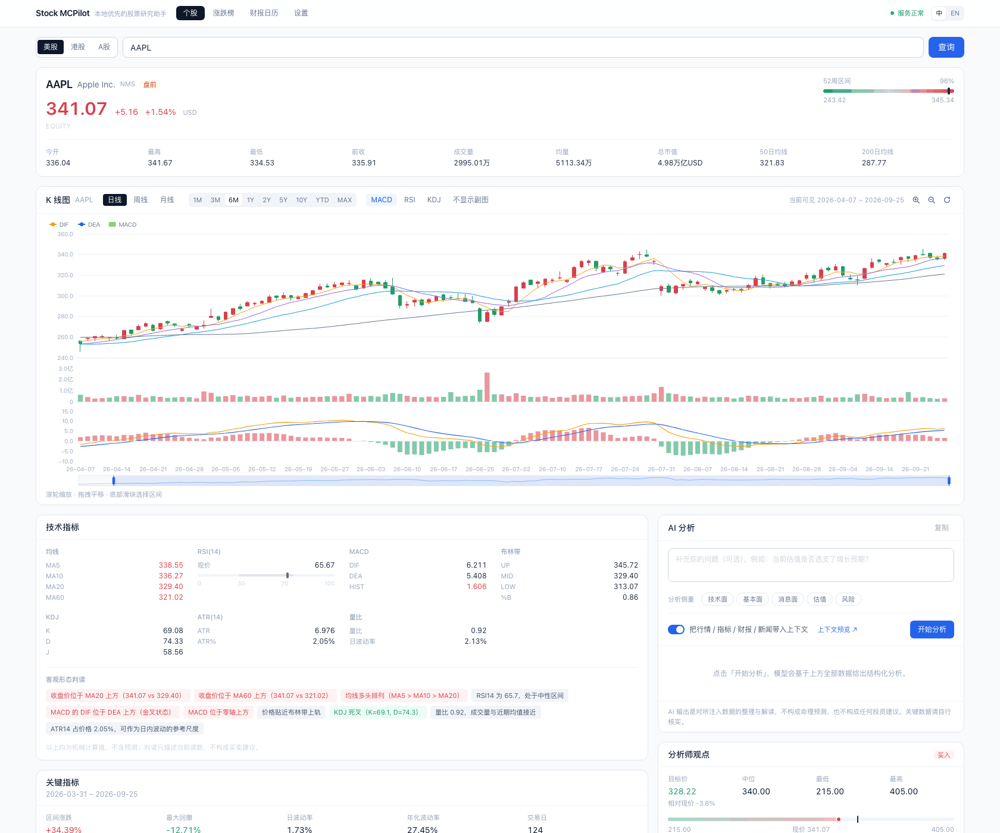
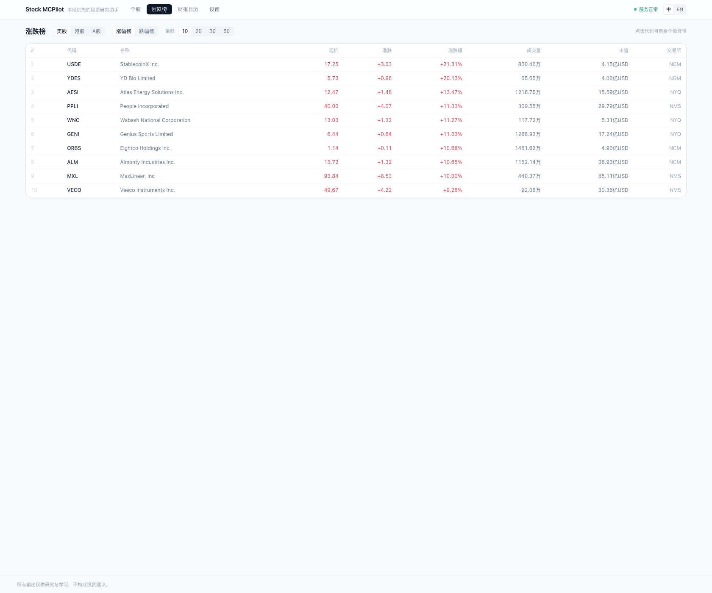
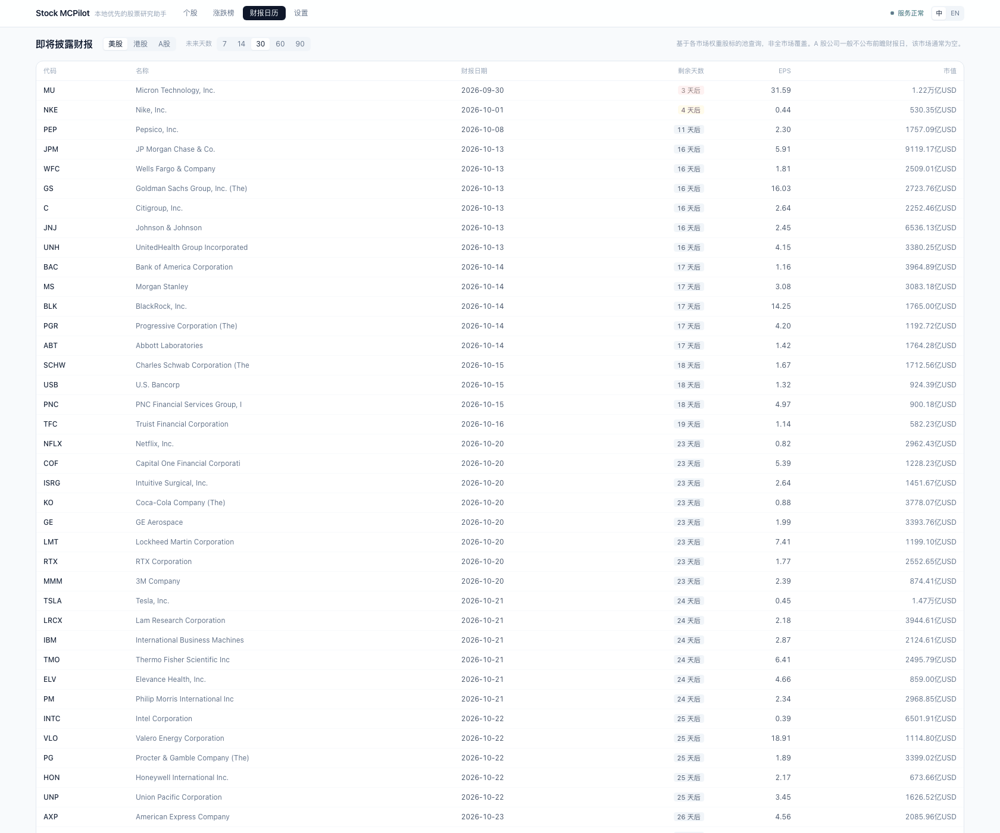
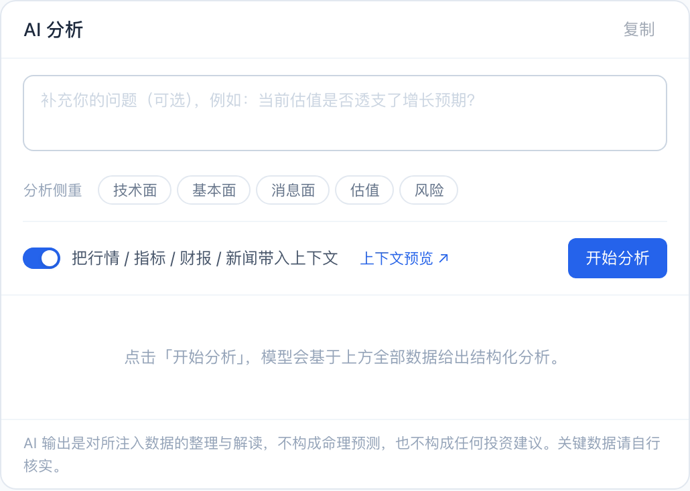
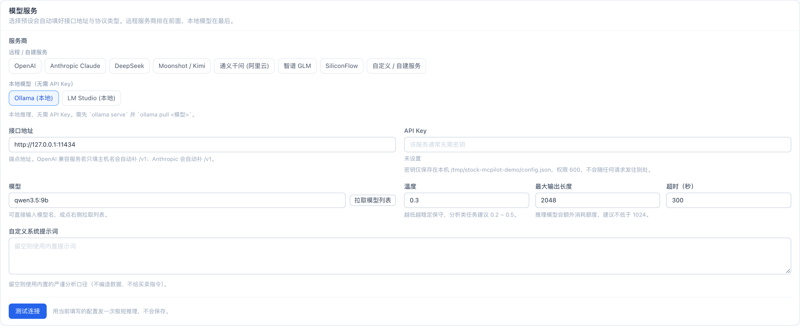

# Stock MCPilot

[English](README.md) · **简体中文**

> 本地优先的股票研究驾驶舱。行情、可交互图表、财务数据、新闻与 AI 解读 ——
> 由**你自己选**的模型驱动，全部跑在**你自己的机器**上。

[](LICENSE)
[](https://www.python.org/)
[](https://nodejs.org/)
[](https://tauri.app/)

大多数"AI 炒股"工具要求你把持仓数据和 API Key 交给别人的服务器。Stock MCPilot 反过来：
所有东西都在本地跑，密钥不出本机，模型由你指定 —— 可以是云端 API（OpenAI、Anthropic、
DeepSeek…），也可以是你自己显卡上的本地模型（Ollama、LM Studio）。

---

## 目录

- [界面预览](#界面预览)
- [功能](#功能)
- [配置模型](#配置模型)
  - [远程服务商](#远程服务商)
  - [本地模型](#本地模型)
  - [你的 API Key 存在哪](#你的-api-key-存在哪)
- [快速开始](#快速开始)
- [运行桌面应用](#运行桌面应用)
- [配置项参考](#配置项参考)
- [项目结构](#项目结构)
- [测试](#测试)
- [常见问题](#常见问题)
- [参与贡献](#参与贡献)

---

## 界面预览



*一个标的的全部信息都在一屏：报价、可交互图表、技术读数，以及一个会明确告诉你
"我准备把哪些内容发给模型"的 AI 分析面板。*

---

## 功能

### 📈 一个标的，一屏看全

输入代码或公司名 —— `AAPL`、`0700`、`600519` —— 拿到完整画像：现价与涨跌、
52 周区间位置、今开/最高/最低/昨收、成交量、成交额、市值、50 日与 200 日均线，
以及按各市场时区解析出的交易时段状态（盘前 / 交易中 / 午间休市 / 已收盘）。

搜索覆盖 **美股、港股、A 股**，中英文都能搜。

### 📊 真正能开的图表


- K 线叠加 **MA5/10/20/60** 与 **布林带**
- **成交量、MACD、RSI、KDJ** 四个副图，可独立开关
- 周期与粒度自由切换：`1M 3M 6M 1Y 2Y 5Y 10Y YTD MAX` ×
  `1m 5m 15m 30m 60m 1d 1wk 1mo`
- **放大 / 缩小 / 重置缩放**，支持滚轮缩放、拖拽平移、底部滑块选区间，
  并实时显示当前可见窗口（`当前可见 2026-04-07 ~ 2026-09-25`）

红涨绿跌 —— 中文市场真正在用的那套配色。

### 🔥 涨跌榜



分市场列出涨幅榜与跌幅榜，可排序，带价格、涨跌额、成交量与市值。

### 📅 财报日历



可配置时间范围内的待披露财报，带倒计时天数、EPS 预期与市值。
（基于各市场权重股标的池查询，非全市场覆盖。A 股公司一般不公布前瞻财报日，
该市场通常为空 —— 应用会直接说明这一点，而不是假装有数据。）

### 🔬 基本面、预期与分析师观点

| 面板 | 内容 |
|---|---|
| **技术指标** | MA / RSI / MACD / 布林带 / KDJ / ATR / 量比，每项都配一句人话解读（"收盘价位于 MA20 上方"、"MACD 金叉"、"RSI 65.7，处于中性偏强区间"） |
| **关键指标** | 区间涨跌幅、最大回撤、日波动率、年化波动率、单日最大涨/跌幅、上涨与下跌天数 |
| **公司概况** | 板块、行业、员工数、官网，估值（P/E、PEG、P/B、P/S、EV/EBITDA），盈利能力（毛利率、净利率、营业利润率、ROE、ROA），资产负债（负债权益比、流动比率、速动比率），分红，分析师目标价，做空数据 |
| **财务报表** | 年度与季度报表 |
| **财报与预期** | 下次财报日、EPS 历史与超预期幅度、EPS 与营收预期、趋势与修正 |
| **分析师观点** | 目标价最高/均值/中位/最低、各期评级分布、机构与内部人持股 |
| **近期新闻** | 标题、来源、时间，以及跳转原文的链接 |

### 🤖 知道自己在说什么的 AI 分析



选择分析侧重 —— **技术面 / 基本面 / 消息面 / 估值 / 风险** —— 也可以补一句你自己的问题，
然后点「开始分析」。在发出任何请求之前，可以展开
**「将注入模型的内容」**，逐字阅读实际拼装出来的提示词。

上下文由你正在看的同一批数据构成：报价、技术指标快照、K 线摘要、公司概况、财务报表、
财报预期、分析师观点与近期新闻。每个数据段都能单独开关，并且有字符预算上限，
不会一不小心撑爆模型的上下文窗口。

回复以流式方式逐字返回，按 Markdown 渲染，可一键复制。

> AI 输出是对数据的**文化性解读，不构成投资预测**。内置系统提示词禁止编造数据，
> 也不给买卖指令。这里没有任何内容构成投资建议。

---

## 配置模型



打开 **设置 → 模型服务**。服务商按分组排列，**远程在前、本地在最后**：

```
远程 / 自建服务   OpenAI · Anthropic Claude · DeepSeek · Moonshot / Kimi ·
                 通义千问（阿里云）· 智谱 GLM · SiliconFlow · 自定义 / 自建服务
本地模型          Ollama · LM Studio
```

选中一个预设，接口地址与协议类型会自动填好。然后点 **测试连接** ——
它会真的跑一个来回（列模型 **加上** 一次极短推理），所以绿灯代表"真的能推理"，
而不只是"端口是通的"。

### 远程服务商

| 服务商 | 接口地址（自动填充） | Key 申请 | 模型示例 |
|---|---|---|---|
| **Anthropic Claude** | `https://api.anthropic.com` | [console.anthropic.com](https://console.anthropic.com/settings/keys) | `claude-sonnet-5` |
| **OpenAI** | `https://api.openai.com/v1` | [platform.openai.com](https://platform.openai.com/api-keys) | `gpt-4o-mini` |
| **DeepSeek** | `https://api.deepseek.com/v1` | [platform.deepseek.com](https://platform.deepseek.com/) | `deepseek-chat` |
| **Moonshot / Kimi** | `https://api.moonshot.cn/v1` | [platform.moonshot.cn](https://platform.moonshot.cn/) | `moonshot-v1-8k` |
| **通义千问（阿里云）** | `https://dashscope.aliyuncs.com/compatible-mode/v1` | [bailian.console.aliyun.com](https://bailian.console.aliyun.com/) | `qwen-plus` |
| **智谱 GLM** | `https://open.bigmodel.cn/api/paas/v4` | [open.bigmodel.cn](https://open.bigmodel.cn/) | `glm-4-flash` |
| **SiliconFlow** | `https://api.siliconflow.cn/v1` | [siliconflow.cn](https://siliconflow.cn/) | `Qwen/Qwen2.5-7B-Instruct` |
| **自定义 / 自建服务** | 任意 | — | — |

**Anthropic** 走的是原生 Messages API（`POST /v1/messages`，请求头
`anthropic-version: 2023-06-01`），不是 OpenAI 兼容的仿制端点 —— 所以系统提示词、
`max_tokens`、流式增量都严格按官方文档的行为来。当前可用模型：
`claude-opus-5-5`（最强）、`claude-sonnet-5`（速度与智能兼顾，默认）、
`claude-haiku-4-5-20251001`（最便宜）。

**自定义 / 自建服务** 适用于任何提供 `/v1/chat/completions` 的服务 —— vLLM、LocalAI、
one-api、公司内网网关。若指向 Anthropic 兼容网关，填 `/v1/messages` 的地址也能自动识别协议。

**举个例子：30 秒接上 Anthropic**

1. 到 `console.anthropic.com` → *API keys* 建一个 Key
2. 设置 → 模型服务 → 点 **Anthropic Claude**
3. 把 Key 粘进 **API Key**（界面显示为 `sk-a****wxyz`，明文只存在本机）
4. 模型留默认的 `claude-sonnet-5`，或自己填别的
5. 点 **测试连接** → 期望看到「连接与推理均正常（… ms）」
6. 点 **保存**

### 本地模型

不需要 API Key、不按 token 计费、数据不出本机。

**Ollama**

```bash
# 1. 从 https://ollama.com/download 安装，然后：
ollama pull qwen3.5:9b      # 或者 llama3.1:8b、qwen3:14b、deepseek-r1:8b …
ollama serve                # 通常已经作为后台服务在跑了
```

然后在 **设置 → 模型服务 → Ollama (本地)** 点 **拉取模型**，从下拉列表里选一个。
默认地址是 `http://127.0.0.1:11434`。

> 推理模型（`qwen3`、`deepseek-r1` 等）会先花掉大量 token 写思维链，然后才写正文，
> 而这些 token **也计入「最大输出长度」**。所以要给得宽裕 —— 有些模型光是回一句
> 「好的」就能用掉几百个 token。
>
> 「测试连接」的探针用的是**自己的固定预算**（1024–4096），不跟随你的设置，
> 所以思考量特别大的模型可能出现"测试不过、但分析正常"。详见[常见问题](#常见问题)。

**LM Studio**

1. 从 [lmstudio.ai](https://lmstudio.ai/) 安装，在 *Discover* 标签页下载一个模型
2. 切到 *Developer* 标签页 → 点 **Start Server**（默认端口 `1234`）
3. 回到应用：**设置 → 模型服务 → LM Studio (本地)**，点 **拉取模型**，
   选中你刚加载的那个模型

模型名必须和 LM Studio 实际加载的一致 —— 如果列表是空的，说明还没加载模型。

**其它情况**：用 **自定义 / 自建服务**，填完整的 base URL。

### 你的 API Key 存在哪

- 写入 `~/.stock-mcpilot/config.json`，目录权限 `0700`、文件权限 `0600`
- **绝不**通过 HTTP 返回。接口只暴露掩码（`sk-a****wxyz`）和一个 `api_key_set` 布尔位。
  连异常信息都会检查是否夹带了密钥
- **绝不**写日志，也不会被塞进发给模型的上下文里
- 后端只监听 `127.0.0.1`。`python run.py --host 0.0.0.0` 会被直接拒绝，除非显式加
  `--allow-remote` —— 否则同局域网内任何人都能透过 `/llm/chat` 烧掉你的 API 额度
- 桌面应用只通过回环地址访问后端，并启用了严格的 CSP

---

## 快速开始

### 0. 环境要求

| | 版本 | 用途 |
|---|---|---|
| **Python** | 3.10 或更高（推荐 3.11 / 3.12） | 后端 —— 必需 |
| **Node.js** | 18 或更高（推荐 20 LTS） | 网页界面 —— 必需 |
| **Rust** | 1.77+ stable | 桌面应用 —— 可选 |
| **WebView2** | — | 仅 Windows 桌面端（Win 11 与多数 Win 10 已预装） |
| **WebKitGTK** | — | 仅 Linux 桌面端（见下） |

### 1. 获取代码

```bash
git clone https://github.com/<你的账号>/stock-mcpilot.git
cd stock-mcpilot
```

### 2. 配置后端环境

<details open>
<summary><b>macOS / Linux</b></summary>

```bash
python3 -m venv .venv
source .venv/bin/activate
pip install --upgrade pip
pip install -r backend/requirements.txt
```
</details>

<details>
<summary><b>Windows（PowerShell）</b></summary>

```powershell
python -m venv .venv
.venv\Scripts\Activate.ps1
python -m pip install --upgrade pip
pip install -r backend\requirements.txt
```

如果 PowerShell 拒绝执行激活脚本：

```powershell
Set-ExecutionPolicy -Scope Process -ExecutionPolicy Bypass
```
</details>

<details>
<summary><b>Windows（cmd.exe）</b></summary>

```cmd
python -m venv .venv
.venv\Scripts\activate.bat
python -m pip install --upgrade pip
pip install -r backend\requirements.txt
```
</details>

> `akshare` 是可选依赖里比较重的一个，只用于 A 股名称查询。装不上也不影响使用，
> 应用会优雅降级。

### 3. 启动后端

```bash
python run.py                 # http://127.0.0.1:8000
python run.py --port 8001     # 8000 被占用时
python run.py --reload        # 开发模式：改代码自动重启
```

自检：`curl http://127.0.0.1:8000/health` → `{"status":"ok","version":"0.2.0",...}`

### 4. 启动网页界面

**另开一个终端**：

```bash
cd frontend
npm install
npm run dev                   # http://localhost:5173
```

打开 <http://localhost:5173>。界面会轮询 `/health`，后端起来之后会自动恢复连接。

### 5. 配置模型

设置 → 模型服务 → 选服务商 → 填 Key（或用本地模型）→ **测试连接** → **保存**。
详见[配置模型](#配置模型)。

---

## 运行桌面应用

同一套代码也能构建成原生桌面应用（Tauri 2）。桌面壳会把 Python 后端作为
**sidecar** 一起启动，所以最终用户完全不需要装 Python。

**开发模式**（需要 Rust；后端请自己在另一个终端里跑 —— 开发模式下桌面壳只探测、
不自动拉起后端，因为开发者手上有好几套 Python 环境，壳不该替人挑）：

```bash
cd frontend
npm run tauri dev
```

**构建正式安装包：**

```bash
# 1. 把后端冻结成单个可执行文件（含 Python 与依赖；约 44 MB，冷启动约 20 秒）
bash scripts/build-sidecar.sh

# 2. 构建应用
cd frontend && npm run tauri build -- --config ../src-tauri/tauri.bundle.conf.json
```

> 那个 `--config` 不是可选项：`externalBin`（也就是 sidecar）放在
> `src-tauri/tauri.bundle.conf.json` 而不是主配置里，因为 `tauri-build` 在
> `cargo check` 和 `tauri dev` 阶段就会校验 `externalBin` —— 一旦 sidecar 缺失，
> 连日常开发构建都会一起挂掉。

**Linux 桌面端前置依赖**（Debian/Ubuntu）：

```bash
sudo apt update
sudo apt install libwebkit2gtk-4.1-dev build-essential curl wget file \
  libxdo-dev libssl-dev libayatana-appindicator3-dev librsvg2-dev
```

**Windows 桌面端**：安装 *Microsoft C++ Build Tools*（勾选 "Desktop development with
C++"）与 WebView2。两者在
[Tauri 前置依赖指南](https://tauri.app/start/prerequisites/)里都有说明。

---

## 配置项参考

大多数人用不到这一节 —— 设置页已经覆盖了全部功能。环境变量主要服务于 CI、脚本化部署，
以及"不想把 Key 落在配置文件里"的场景。它们**覆盖** `config.json`，被锁定的字段会在
界面顶部以 `locked_by_env` 标出。

| 变量 | 作用 | 默认值 |
|---|---|---|
| `SMP_LLM_PRESET` | 服务商预设（`ollama`、`anthropic`、`openai`…） | `ollama` |
| `SMP_LLM_KIND` | 协议覆盖（`ollama` / `openai_compat` / `anthropic`） | 由预设推断 |
| `SMP_LLM_BASE_URL` | 接口地址 | 预设自带 |
| `SMP_LLM_API_KEY` | API Key | 空 |
| `SMP_LLM_MODEL` | 模型名 | 空 |
| `SMP_ANALYSIS_LANGUAGE` | 分析输出语言（`zh` / `en`） | `zh` |
| `SMP_BIND_HOST` / `SMP_BIND_PORT` | 后端监听地址 | `127.0.0.1` / `8000` |
| `STOCK_MCPILOT_HOME` | 覆盖配置目录 | `~/.stock-mcpilot` |

旧变量名 `LLM_MODE`、`LLM_API_KEY`、`LLM_LOCAL_MODEL`、`OLLAMA_ENDPOINT`、
`APP_LANGUAGE` 仍然有效（优先级更低）。参见 `.env.example`。

---

## 项目结构

```
stock-mcpilot/
├── backend/                     FastAPI 后端
│   ├── main.py                  应用装配、/health、版本号
│   ├── config.py                持久化、环境变量覆盖、密钥掩码、服务商预设
│   ├── providers/               LLM 协议实现
│   │   ├── base.py              接口、错误分类、思维链标签剥离
│   │   ├── openai_compat.py     /v1/chat/completions
│   │   ├── anthropic.py         原生 Messages API
│   │   ├── ollama.py            /api/chat
│   │   └── factory.py           预设 → 协议的路由
│   ├── marketdata/              yfinance 客户端、涨跌榜、代码搜索、A 股名称
│   ├── analysis/                技术指标、提示词与上下文拼装
│   ├── routers/                 stocks · analysis · llm · config
│   ├── storage/                 SQLite 缓存
│   └── schemas/                 pydantic 请求/响应模型
├── frontend/                    React 18 + Vite + Tailwind + ECharts
│   └── src/
│       ├── pages/               个股 · 涨跌榜 · 财报日历 · 设置
│       ├── charts/              K 线图与缩放 hook
│       ├── components/          报价头部、指标面板、分析面板、新闻…
│       ├── store/               zustand 状态
│       └── i18n/                中英文文案
├── src-tauri/                   桌面壳（Rust）
│   ├── src/backend.rs           sidecar 生命周期：探测、选空闲端口、收尾
│   ├── src/main.rs              Tauri 应用与 IPC 命令
│   ├── capabilities/            窗口权限
│   └── tauri.bundle.conf.json   externalBin（仅打包时叠加）
├── scripts/                     构建与验证工具
└── run.py                       后端启动器（人与 sidecar 共用）
```

**技术栈：** FastAPI · pydantic · SQLite · pandas/NumPy · yfinance（+ akshare）·
React 18 · Vite · Tailwind · ECharts · zustand · Tauri 2 · PyInstaller

---

## 测试

验证工具需要两个应用本身不需要的包：

```bash
pip install -r backend/requirements-dev.txt    # websockets（CDP）+ Pillow（截图压缩）
```

```bash
# LLM 提供商 —— 离线、走真实 socket、不需要 API Key
.venv/bin/python scripts/test_llm_providers.py

# 后端接口冒烟（自己拉起服务；--quick 跳过慢用例）
.venv/bin/python scripts/smoke_api.py
.venv/bin/python scripts/smoke_api.py --quick

# 界面端到端 —— 无头 Chrome、真实行为断言、顺带出截图
.venv/bin/python scripts/verify_ui.py
SMP_SHOT_DIR=docs/screenshots/zh SMP_UI_LANG=zh .venv/bin/python scripts/verify_ui.py

# Rust 后端进程管理模块（不用等 Tauri 依赖树）
cargo test --manifest-path scripts/backend-rs-test/Cargo.toml

# 前端类型检查
cd frontend && npm run typecheck
```

这些脚本都会把后端指向一个**隔离的配置目录**，所以跑测试**不会**动到你自己的
`~/.stock-mcpilot/config.json` 和 API Key。

*（Windows 上把 `.venv/bin/python` 换成 `.venv\Scripts\python`；上面的环境变量前缀写法是
POSIX 的，PowerShell 里请先 `$env:SMP_UI_LANG="en"`。）*

`verify_ui.py` 断言的是**行为**而不只是"按钮存在" —— 比如点「放大」后可见区间真的
变窄（171 天 → 110 天）、点「重置缩放」后能还原，以及 K 线 canvas 上确实同时存在
红绿两种蜡烛像素。它还会验证界面确实渲染成了你指定的语言。

---

## 常见问题

| 现象 | 处理 |
|---|---|
| 界面提示「无法连接后端」 | 确认 `python run.py` 正在运行，端口与界面配置一致（默认 `127.0.0.1:8000`）。 |
| 提示「尚未选择模型」 | 设置 → **拉取模型** → 选一个 → **保存**。 |
| 提示「模型只产出了思维链、没有正文」 | 推理模型（`qwen3`、`deepseek-r1` 等）把输出预算花在思考上了。调大**最大输出长度** —— 注意思考的 token 也算在这个额度里，所以要给得比答案本身宽裕得多。 |
| 「测试连接」报上面这个错，但分析能用 | 推理模型下的正常现象。测试连接的探针**故意用自己的预算**（1024–4096 token），不跟随你的设置，所以思考量大的模型可能测不过。报错信息里会写明它实际用的上限。分析能跑就忽略这条。 |
| 提示「模型完成了思考，但没有输出正文」 | 这**不是**长度问题 —— 输出是正常收尾的。换一个更明确的提问，或改用非推理模型。 |
| 云端服务商提示「无法连接」 | 你的网络可能到不了 `api.anthropic.com` / `api.openai.com`。在启动后端的那个环境里设置 `HTTPS_PROXY`。 |
| 云端服务商返回 HTTP 502 / 503 / 504 | 通常是中间代理够不到上游，而不是厂商挂了。 |
| A 股只显示代码、没有中文名 | `akshare` 缺失或导入失败。它是可选依赖，其它功能不受影响。 |
| A 股财报日历是空的 | 属于预期行为。A 股公司一般不公布前瞻财报日。 |
| `cargo check` 报 `binaries/…` 资源不存在 | 先跑 `bash scripts/build-sidecar.sh`，或打包时带上 `--config ../src-tauri/tauri.bundle.conf.json`。 |

---

## 参与贡献

欢迎提 issue 和 PR。下面几点能让 PR 更容易被合并：

- **先跑一遍上面的测试** —— 它们很快，而且完全离线
- **保持分层** —— 协议实现放 `backend/providers/`，提示词拼装放 `backend/analysis/`，
  界面文案放 `frontend/src/i18n/`
- **加服务商？** 通常只需在 `PROVIDER_PRESETS`（`backend/config.py`）里加一条。
  如果是**新协议**，需要在 `backend/providers/` 加一个类，并在
  `scripts/test_llm_providers.py` 里补测试
- **坚持确定性** —— 引擎必须可复现；数据确实拿不到时就返回"拿不到"，
  而不是猜一个看起来合理的数字

---

感谢你看到这里 —— 希望 Stock MCPilot 能让你的研究快一点、也私密一点，
并且有朝一日成为你每天都会打开的工具。🚀

这个项目靠更多人的参与才会变得更好，所以无论你是想报一个 bug、提一个功能想法，
还是希望支持某家服务商，都欢迎开 issue 或直接提 PR —— 每一份贡献都真心感谢。🙌
